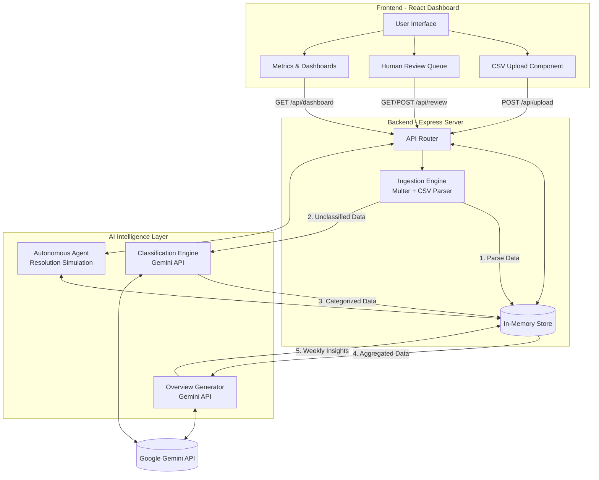

# Dhaga & Co. Return Intelligence System

This document outlines the technology stack and architecture of the Dhaga & Co. Return Intelligence System. The system is designed to automate the classification and resolution of e-commerce returns (specifically for a D2C fashion brand) using AI.

## Technology Stack

### Frontend
*   **Framework**: [React 19](https://react.dev/) via [Vite](https://vitejs.dev/) for fast development and optimized builds.
*   **Language**: [TypeScript](https://www.typescriptlang.org/) for robust, type-safe code.
*   **Styling**: [Tailwind CSS v4](https://tailwindcss.com/) for rapid UI development and styling.
*   **Icons**: [Lucide React](https://lucide.dev/) for consistent, clean iconography.
*   **Animations**: [Motion](https://motion.dev/) for smooth UI transitions and interactions.

### Backend
*   **Server**: [Node.js](https://nodejs.org/) with [Express.js](https://expressjs.com/) for handling REST API requests.
*   **Language**: [TypeScript](https://www.typescriptlang.org/) (executed using `tsx` during development).
*   **File Uploads**: [Multer](https://github.com/expressjs/multer) for parsing incoming CSV files containing return data.
*   **Data Storage**: In-memory data structures (managed within `server/store.ts` and `server/resolutionAgent.ts`) with CSV sample seeding.

### AI & Machine Learning
*   **Intelligence Provider**: **Google Gemini API** (`@google/genai`).
*   **Capabilities**:
    *   **Text Classification**: Parsing free-text user comments in the "Other" return category into structured sub-categories (e.g., sizing, quality).
    *   **Generative Overview**: Synthesizing weekly return metrics and categorized data into a coherent business overview brief.

---

## Architecture Overview

The system follows a modern client-server architecture with a specialized AI layer. The frontend acts as a command center for human operators to monitor metrics, upload return data, and review AI decisions. The backend orchestrates data ingestion, triggers AI model calls, and manages the state of autonomous resolution workflows.

### Core Workflows

1.  **Data Ingestion & Classification**:
    *   A CSV containing return reasons is uploaded via the frontend.
    *   The backend's Ingestion Engine (`multer`) processes the file and batches the data.
    *   The Classification Engine sends "Other" reasons to the Gemini API to categorize them (e.g., extracting precise reasons from vague comments like "it didn't fit right").
    *   High-confidence classifications are **auto-approved**. Low-confidence ones are flagged and pushed to the Human Review Queue.

2.  **Human-in-the-Loop Review**:
    *   Human operators use the frontend Review view to examine flagged returns.
    *   They can approve, dismiss, or manually edit the labels assigned by the AI.

3.  **Autonomous Resolution Agent**:
    *   The system includes an agent that attempts to resolve returns proactively. 
    *   It simulates automated outreach (like a WhatsApp negotiation) to propose alternative resolutions (like a doorstep exchange) before the brand incurs reverse logistics costs.

4.  **Reporting & Insights**:
    *   As returns are classified and resolved, the Overview Generator periodically asks Gemini to write executive summaries based on the aggregated data in the store, surfaced directly in the dashboard.
