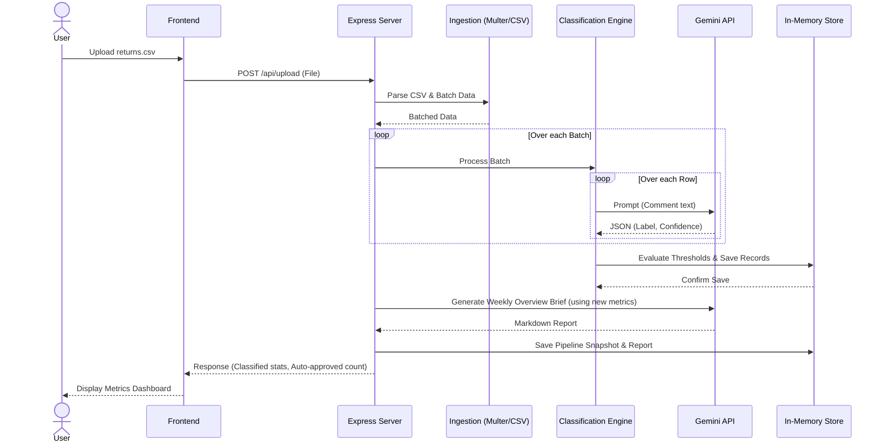

# Low-Level Design (LLD): Dhaga & Co. Return Intelligence System

## 1. Introduction

This document provides a detailed Low-Level Design (LLD) for the Dhaga & Co. Return Intelligence System. It breaks down the architecture stage by stage and explains the rationale behind critical design and technology choices. The goal of this document is to serve as a comprehensive reference to answer any architectural questions regarding the system's construction, specifically why certain patterns were chosen for this MVP (Minimum Viable Product).

---

## 2. Architectural Paradigm & Global Design Choices

The application uses a **Client-Server Architecture** with a lightweight Node.js/Express backend serving a React Single Page Application (SPA).

### Key Design Choices & Rationale

*   **Why Node.js + Express over heavier frameworks (NestJS, Django, Spring Boot)?**
    *   *Rationale*: The core value of this MVP is its AI orchestration. The backend acts primarily as a lightweight proxy between the UI and the Google Gemini API. Express provides a minimal, unopinionated routing layer that minimizes boilerplate, enabling rapid iteration without the overhead of enterprise-level frameworks.
*   **Why an In-Memory Datastore over a persistent Database (PostgreSQL, MongoDB)?**
    *   *Rationale*: For an MVP and prototype, speed of setup and ease of demonstration are paramount. Using an in-memory datastore (`server/store.ts`) removes external dependencies, schema migrations, and hosting complexity. While volatile (data resets on server restart), it is sufficient to prove the AI classification and human-in-the-loop concepts.
*   **Why React + Vite for the Frontend?**
    *   *Rationale*: Vite provides near-instant Hot Module Replacement (HMR) and fast builds compared to older bundlers like Webpack. React’s component-based model is ideal for building the dashboard’s complex interactive views (Upload, Review Queue, Metrics).
*   **Why Google Gemini API?**
    *   *Rationale*: Gemini provides high-quality reasoning and structured output capabilities out of the box, which are essential for taking unstructured text ("The kurti was too tight around the shoulders") and mapping it to a strict taxonomy ("Fit: Shoulders", Confidence: 0.95).

---

## 3. Stage-by-Stage Architecture Deep Dive

The system's operation can be divided into six distinct stages.

### Stage 1: Data Ingestion

*   **Components**: Frontend Upload (`UploadView.tsx`), Backend Route (`POST /api/upload`), Ingestion Engine (`server/ingest.ts`).
*   **Flow**:
    1.  The user uploads a CSV file containing unstructured return data.
    2.  The Express server receives the file using **Multer**.
    3.  `ingest.ts` parses the CSV and groups the rows into batches.
*   **Design Choices**:
    *   **Multer Memory Storage vs. Disk Storage**: The system uses `multer.memoryStorage()`. For small CSV batches (typical for daily/weekly MVP test uploads), holding the file buffer in memory is faster and avoids disk I/O bottlenecks and cleanup logic. A 10MB limit is enforced to prevent heap exhaustion.
    *   **Batching Strategy**: CSV records are broken into batches before processing. This prevents overwhelming the Gemini API with too many parallel requests (avoiding rate limits) and ensures the node event loop isn't blocked.

### Stage 2: AI Classification & Taxonomy

*   **Components**: Classification Engine (`server/classify.ts`).
*   **Flow**:
    1.  Batched records are sent to the Gemini API with a heavily engineered system prompt.
    2.  The LLM attempts to classify the unstructured "Other" reason into the Dhaga taxonomy.
    3.  The model returns structured JSON containing a label, confidence score, and rationale.
*   **Design Choices**:
    *   **Confidence-Based Routing**: Rather than trusting the LLM blindly, the system requires a confidence score. If `confidence >= AUTO_APPROVE_AT` (e.g., 75%), the record is marked "accepted". If it falls below this threshold, it is marked "review". This hybrid approach mitigates AI hallucinations and ensures quality control for edge cases.

### Stage 3: State Management & Storage

*   **Components**: In-Memory Store (`server/store.ts`).
*   **Flow**:
    1.  Processed records from Stage 2 are inserted into arrays in `store.ts`.
    2.  The store exposes getter/setter functions (e.g., `getReviewQueue()`, `updateCaseStage()`).
*   **Design Choices**:
    *   **Encapsulation**: Even though it's an in-memory array, all state mutations happen through designated functions. This isolates the data layer so that when the system scales to a real database (like PostgreSQL), only the functions in `store.ts` need to be rewritten, leaving the API routes untouched.

### Stage 4: Human-in-the-loop (HITL) Review

*   **Components**: Review Dashboard (`ReviewQueueView.tsx`), Review Endpoints (`/api/review/:event_id/...`).
*   **Flow**:
    1.  Records that failed the auto-approval threshold are pulled by the frontend.
    2.  A human operator reviews the LLM's rationale and either approves, edits, or dismisses the label.
    3.  The backend updates the record in the Store.
*   **Design Choices**:
    *   **Optimistic UI vs. Server Truth**: The frontend relies on the server as the source of truth, refreshing state after an action. This avoids complex local state synchronization issues at the cost of slight latency.

### Stage 5: Autonomous Resolution Agent

*   **Components**: Resolution Simulator (`server/resolutionAgent.ts`).
*   **Flow**:
    1.  A simulated state machine runs, moving return cases through stages: `open` -> `doorstep_exchange_confirmed` or `voice_call_triggered`.
*   **Design Choices**:
    *   **State Machine Simulation**: To demonstrate agentic capabilities (like automated WhatsApp negotiations) without requiring the setup of Twilio or Meta Business accounts for the MVP, the system uses deterministic state transitions. This clearly illustrates the *business value* of the agent (saving reverse logistics costs) while deferring the complex 3rd-party integrations to the production phase.

### Stage 6: Overview & Insights Generation

*   **Components**: Overview Generator (`server/overview.ts`).
*   **Flow**:
    1.  Upon completing a batch upload and classification, the system aggregates basic metrics (total returns, accepted, in review).
    2.  These metrics are fed back into Gemini with a prompt to act as a "Business Analyst".
    3.  Gemini generates a Markdown-formatted executive brief.
*   **Design Choices**:
    *   **Generative Reporting vs. Rule-Based Reporting**: Traditional systems use hardcoded rules to generate insights ("If returns > 10%, print 'High returns'"). By using a Generative AI for the overview, the system can dynamically highlight anomalous taxonomy clusters (e.g., "A sudden spike in shoulder fit issues for KURTI123") that hardcoded rules might miss.

---

## 4. Sequence Diagram: Core Ingestion & Classification Flow

The following diagram illustrates the interactions between system components during the most complex operation: CSV upload and classification.

## 5. Future Scalability Considerations

If this MVP transitions to a production-grade system, the following architectural shifts are required:

1.  **Replace In-Memory Store with RDBMS**: Transition `store.ts` to use PostgreSQL (via Prisma or Drizzle ORM) to handle persistent, relational data.
2.  **Asynchronous Message Queue for Classification**: Currently, the frontend waits for the entire CSV to be classified. For large files, this will cause HTTP timeouts. Introduce a queue (e.g., Redis/BullMQ), respond to the upload immediately with a `job_id`, and have the frontend poll or use WebSockets for progress updates.
3.  **Real Webhook Integrations**: Replace the simulated `resolutionAgent.ts` with real webhooks receiving events from WhatsApp (via Twilio/Gupshup) and triggering logic based on customer replies.
